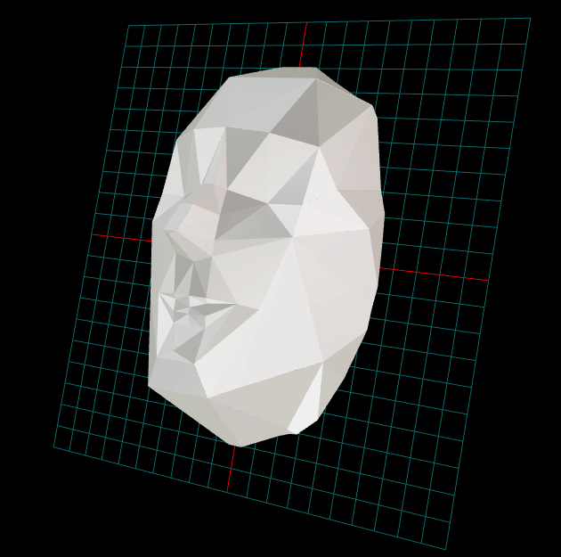
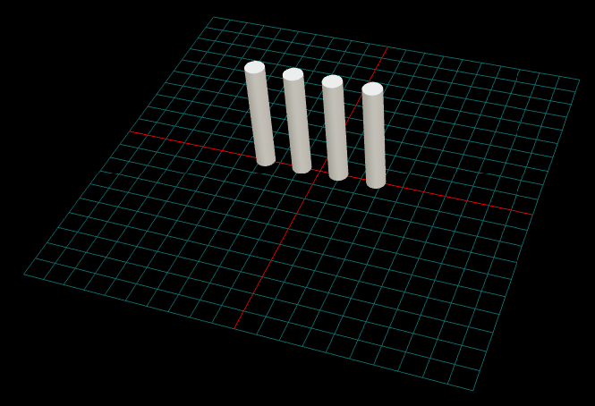

# py-3d-construct-lib

A Python library for 3D geometric construction, mesh manipulation, and spherical tools.

## Overview

`py-3d-construct-lib` provides a comprehensive set of tools for working with 3D geometry, particularly focused on:

- **Spherical geometry and coordinate transformations**
- **3D mesh partitioning and manipulation**
- **Geometric construction utilities**
- **Face point cloud generation and processing**
- **Calibrated paper tools for precise printing**

## Features

### Coordinate System Transformations

The library provides powerful tools for rigid body transformations between coordinate systems:

- **`coordinate_system_transform`**: Compute rigid transformations (rotation + translation) to align one coordinate system to another
- **`coordinate_system_transformation_function`**: Create transformation functions that can be applied to objects using custom rotation and translation generators
- **`coordinate_system_transform_to_matrix`**: Convert transformation parameters to 4x4 homogeneous transformation matrices
- **`matrix_to_coordinate_system_transform`**: Extract transformation parameters from 4x4 matrices

These functions work with coordinate systems defined by origin, up vector, and out vector, using Gram-Schmidt orthogonalization for robust transformations.

### Spherical Tools
- Convert between Cartesian and spherical coordinates
- Spherical triangle manipulation and shrinking
- Rotation matrix calculations from vectors
- Spherical cap filtering and geometric operations

### Geometric Construction
- Icosahedron geometry generation
- Triangle mesh utilities and validation
- Rigid body transformation validation
- Fibonacci sphere point distribution
- Edge normalization and triangle operations

### Mesh Processing
- Mesh partitioning algorithms
- Face point cloud generation
- Region edge feature detection
- Connector hint computation
- Shell mapping and collinear connector merging

### Calibrated Paper Output
- Millimeter-precise geometry rendering
- SVG and PDF export with accurate positioning
- A4 paper layout with customizable margins
- CAD-compatible coordinate system (bottom-left origin)

## Installation

```bash
pip install py-3d-construct-lib
```

## Quick Start

### Coordinate System Transformations

```python
import numpy as np
from py_3d_construct_lib.spherical_tools import (
    coordinate_system_transform,
    coordinate_system_transform_to_matrix,
    matrix_to_coordinate_system_transform
)

# Define two coordinate systems
origin_a = np.array([0, 0, 0])
up_a = np.array([0, 0, 1])      # Z-up
out_a = np.array([1, 0, 0])     # X-out

origin_b = np.array([10, 5, 2])
up_b = np.array([1, 0, 0])      # X-up  
out_b = np.array([0, 1, 0])     # Y-out

# Compute transformation from system A to system B
transform = coordinate_system_transform(origin_a, up_a, out_a, 
                                      origin_b, up_b, out_b)

# Convert to 4x4 transformation matrix
matrix = coordinate_system_transform_to_matrix(transform)

# Extract transformation back from matrix
recovered_transform = matrix_to_coordinate_system_transform(matrix)

print(f"Rotation angle: {transform['rotation_angle']:.3f} radians")
print(f"Rotation axis: {transform['rotation_axis']}")
print(f"Translation: {transform['translation']}")
```

### Basic Spherical Operations

```python
import numpy as np
from py_3d_construct_lib.spherical_tools import (
    spherical_to_cartesian_jackson,
    cartesian_to_spherical_jackson
)

# Convert spherical to cartesian coordinates
sph_coords = (1.0, np.pi/4, np.pi/6)  # (r, theta, phi)
cartesian = spherical_to_cartesian_jackson(sph_coords)

# Convert back to spherical
spherical = cartesian_to_spherical_jackson(cartesian)
```

### Creating Geometric Shapes

```python
from py_3d_construct_lib.geometries import create_icosahedron_geometry

# Create an icosahedron with radius 2.0
vertices, faces = create_icosahedron_geometry(radius=2.0)
print(f"Created icosahedron with {len(vertices)} vertices and {len(faces)} faces")
```

### Calibrated Paper for Precise Printing

```python
from py_3d_construct_lib.calibrated_paper import CalibratedPaper

# Create calibrated paper with 10mm margins
paper = CalibratedPaper(margin_mm=10.0)

# Add rectangles with precise positioning
paper.add_rectangle(x=20.0, y=20.0, width=10.0, height=30.0, 
                   fill_color="lightblue", stroke_color="blue")

# Export to SVG and PDF
paper.save_svg("output.svg")
paper.save_pdf("output.pdf")
paper.print_info()
```

### Fibonacci Sphere Point Distribution

```python
from py_3d_construct_lib.construct_utils import fibonacci_sphere

# Generate 100 evenly distributed points on a sphere
points = fibonacci_sphere(num_points=100, radius=1.0)
```

## Examples

### Face Mesh STL Export

The `examples/create_face_stl.py` script demonstrates how to create 3D printable face meshes from point clouds and export them as STL files. This example showcases the complete workflow from point cloud generation to ready-to-print 3D models.

#### Features

- **Face Point Cloud Generation**: Creates anatomically accurate face point clouds
- **Mesh Triangulation**: Converts point clouds to triangulated meshes
- **3D Printing Optimization**: Scales models to 200mm width with 2.5mm shell thickness
- **Front/Back Partitioning**: Splits faces into mask-like front and back halves
- **STL Export**: Generates ready-to-print STL files

#### Usage

```bash
cd examples
python create_face_stl.py
```

This will generate STL files in the `face_stl_output/` directory:
- `face_m_front.stl` - Front half (mask exterior)
- `face_m_back.stl` - Back half (mask interior) 
- `face_m_complete.stl` - Complete face model

#### Example Output

```
🎭 Face Mesh STL Export Example
================================
Creating face mesh for face type 'm'...
Step 1: Generating face point cloud...
Generated 113 points
Step 2: Creating triangulated mesh...
Created mesh with 113 vertices and 222 faces
Step 2.5: Scaling mesh for 3D printing...
Original dimensions: 0.2844 x 0.4400 x 0.3939 units
Scaling by factor 454.55 to make longest side 200.0mm
Scaled dimensions: 129.3 x 200.0 x 179.0 mm
Step 3: Partitioning mesh...
Partitioning at Z = 26.51mm (front/back split for mask)
Step 4: Creating mesh partition...
Front region (ID 0): 159 faces (mask exterior)
Back region (ID 1): 133 faces (mask interior)
Step 5: Generating 3D printable shells...
✅ Success! Generated STL files in 'face_stl_output' directory
```

#### Applications

- **3D Printing**: Ready-to-print face models and masks
- **Prototyping**: Rapid face geometry prototyping
- **Research**: Facial geometry analysis and visualization
- **Art/Design**: Creative face-based sculptures and models

The generated STL files can be:
- Viewed in STL viewers (MeshLab, 3D Builder, online viewers)
- 3D printed with any FDM or SLA printer
- Imported into CAD software for further editing
- Used as reference models for other applications


*Example of generated face mesh viewed in a 3D viewer*

### Cylinder Mesh Creation and Merging

The `examples/create_cylinder_stl.py` script demonstrates a simple yet powerful workflow for creating cylindrical meshes from point clouds and merging multiple cylinders into a single STL file.

#### Features

- **Parametric Cylinder Generation**: Creates cylinder point clouds with configurable radius, height, and resolution
- **Point Cloud to Mesh**: Converts scattered 3D points to triangulated meshes using convex hull triangulation
- **Mesh Merging**: Combines multiple cylinder meshes with vertex deduplication 
- **Direct STL Export**: Exports complete solid meshes (not hollow shells) ready for viewing or processing
- **Multiple Cylinder Array**: Demonstrates creating arrays of cylinders positioned side-by-side

#### Usage

```bash
cd examples
python create_cylinder_stl.py
```

This will generate `output/cylinder_mesh.stl` containing an array of 4 cylinders.

#### Example Output

```
Creating cylinder mesh...
Step 1: Generating cylinder point cloud...
Generated 485 points for cylinder (radius=5.0mm, height=60.0mm)
Step 2: Creating triangulated mesh...
Created mesh with 485 vertices and 966 faces
Step 3: Creating mesh partition...
Created partition with 966 faces in region 0
Step 4: Exporting mesh as STL...
Successfully exported cylinder mesh to: output/cylinder_mesh.stl
Mesh statistics:
  - Vertices: 1940
  - Triangles: 3864
  - Dimensions: 140.0 x 10.0 x 60.0 mm
  - Bounds: X[-5.0, 135.0] Y[-5.0, 5.0] Z[0.0, 60.0]
```

#### Key Concepts Demonstrated

1. **Point Cloud Generation**: Creates structured point distributions on cylindrical surfaces
2. **Mesh Triangulation**: Uses `PartitionableSpheroidTriangleMesh.from_point_cloud()` for automatic triangulation
3. **Mesh Transformation**: Applies translations to create multiple positioned cylinders
4. **Mesh Merging**: Uses `merge_meshes()` function to combine meshes with tolerance-based vertex merging
5. **STL Export**: Direct export of complete solid geometry using `write_stl_binary()`

#### Configuration Options

The example can be easily modified by adjusting parameters:

```python
# Cylinder dimensions
radius = 5.0        # Cylinder radius in mm
height = 60.0       # Cylinder height in mm

# Point cloud resolution
angular_resolution = 80     # Points around circumference
num_vertical = 2           # Vertical layers on sides
num_top_bottom = 2         # Concentric circles on ends

# Array configuration
num_cylinders = 4          # Number of cylinders in array
spacing = radius * 2 + 10  # Spacing between cylinders
```

#### Applications

- **Mechanical Design**: Creating arrays of pins, rods, or supports
- **3D Printing**: Generating test pieces or mechanical components
- **Educational**: Learning mesh generation and manipulation techniques
- **Prototyping**: Quick creation of cylindrical geometry for testing
- **CAD Integration**: Generating meshes for import into CAD software

The resulting STL files are compatible with:
- 3D printing slicers (Cura, PrusaSlicer, etc.)
- Mesh viewers (MeshLab, 3D Builder, Blender)
- CAD software for further modification
- Analysis tools for geometric verification


*Example of generated cylinder array mesh viewed in a 3D viewer*

## Module Overview

| Module | Description |
|--------|-------------|
| `geometries` | Basic geometric shape generation (icosahedron, etc.) |
| `spherical_tools` | Spherical coordinate systems and transformations |
| `construct_utils` | General construction utilities and validation |
| `face_point_cloud` | Point cloud generation on mesh faces |
| `mesh_partition` | Advanced mesh partitioning algorithms |
| `calibrated_paper` | Precise geometric output for printing |
| `connector_utils` | Connector hint computation and merging |
| `transformed_region_view` | Region transformation and viewing |

## Requirements

- Python 3.8+
- NumPy
- SciPy
- NetworkX
- svgwrite
- reportlab

## Development

This project uses PyScaffold for project structure and management.

```bash
# Install in development mode
pip install -e .

# Run tests
python -m pytest tests

# Format code with precommit script (runs isort + black on src/ and tests/, prettier on workflows)
./precommit.sh

# Or manually format code
black src/
```

## License

[Add your license information here]

## Contributing

[Add contributing guidelines here]